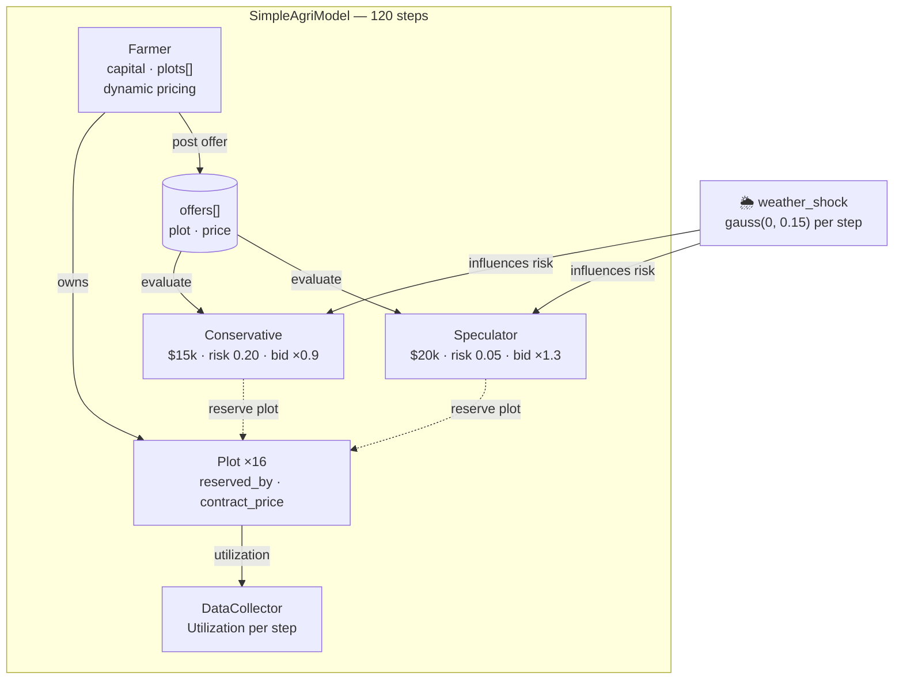

# AI Farmer – Tomato Plot Contract Simulation (Mesa ABM)

**A minimal agent-based model** exploring prepaid farm plot contracts, investor behavior, and the potential emergence of a secondary market.

This is an early prototype inspired by the idea of investors prepaying for fractions of a farm's future produce (like tech companies prepaying for RAM), with the goal of eventually simulating secondary trading of contracts when the farm is "sold out" and expansion loans are delayed.

## Verification Results:
I ran a 120-step simulation on v0.1.0, and you can see the results of the new logic in the logs:

Step 10: Farmer offered a plot for $429 (Util: 0.00).
Step 28: Farmer offered a plot for $630 (Util: 0.50).
Step 45: Farmer offered a plot for $746 (Util: 0.94).
Full Saturation: The market reached 100% utilization by step 46, demonstrating that even with rising prices, speculators were willing to buy based on their high-valuation strategies.

## Current Features (v0.2 – Advanced Primary Market)


- One farmer owns 16 tomato plots (each ~1/4 acre equivalent).

- 20 investors (half speculators, half conservative) evaluate offers using a simple valuation formula





- **Dynamic Farmer Pricing**: The farmer now raises prices as utilization (pre-sold plots) increases, simulating price discovery pressure.
- **Differentiated Investors**: Investors are split into **Speculators** (high risk tolerance, aggressive bidding) and **Conservative** (low risk tolerance, cautious bidding).
- **Seasonal Volatility**: A `weather_shock` varies each step (representing weeks/seasons), affecting how investors value future yields.
- **Valuation Formula**:
  ```
  value = (spot_price × expected_yield × (1 - perceived_risk)) * bid_multiplier
  ```
- **Primary Market Logic**: Farmer offers plots; investors evaluate, purchase if price < valuation, and remove offers from the queue.
- **Mesa 3.5.1 Optimized**: Uses the latest `AgentSet` and model-based agent management patterns.

## Information Effects Research (Core Hypothesis)

We are testing the hypothesis that **information symmetry significantly impacts market stability and price convergence.**

### Information Tiers

| Tier | What the agent knows | Behavioral Implementation |
|---|---|---|
| **Blind** | Only current offer price | Base logic (greedy purchasing) |
| **Local** | Their own trade history | Anchoring to their personally paid average |
| **Market** | Average recent trade prices | Values tied to `model.public_price_index` |
| **Full** | All holdings & valuations | Bidding up based on observed competitor interest |

**Hypothesis**: *Market volatility will decrease but wealth concentration (Gini coefficient) will increase as information availability moves from Blind to Market tiers.*


## Secondary Market (Milestone 2)

A sketch of the upcoming secondary trading logic:
- **Speculator Flip**: Speculators will list holdings for sale (secondary offers) when market price > cost basis + premium.
- **Secondary Discovery**: Other investors will scan secondary offers if the primary farmer is "sold out" or has no active offers.

## Why Mesa 3.5.1 Required These Changes

Mesa underwent major API changes starting in 3.0+ (schedulers removed, `AgentSet` introduced, agent initialization simplified). Many older tutorials/examples still use the deprecated style, which causes errors like:

- `mesa.time` has no `RandomActivation`
- `object.__init__()` takes exactly one argument
- `Agent.__init__()` missing required 'model'
- `module 'mesa' has no attribute 'AgentSet'`

### Key fixes applied in this version:

1. **Agent initialization**:
   ```python
   class Plot(mesa.Agent):
       def __init__(self, model, unique_id, ...):
           super().__init__(model)          # ← only model passed
           self.unique_id = unique_id       # set manually
   ```
   No more `super().__init__(unique_id, model)`.

2. **No explicit scheduler**:
   - Mesa 3.x automatically adds agents to `model.agents` (an `AgentSet`) when `super().__init__(model)` is called in the agent's `__init__`.
   - So we **do not** need to manually create or populate `self.agents = ...` in the model.
   - Step all agents with:
     ```python
     self.agents.shuffle_do("step")   # random activation order
     ```

3. **No `from mesa import agentset`** needed:
   - In Mesa 3.5.1, `AgentSet` is directly accessible via `model.agents` (it's already there).
   - We don't need to import or instantiate `AgentSet` ourselves anymore.

4. **Offers queue** (your addition):
   - Farmer adds offers to `model.offers` list.
   - Investors scan `model.offers` randomly, buy if attractive, remove the offer.
   - Prevents multiple investors buying the same plot in one step (by checking `reserved_by` and removing on purchase).

These changes make the code clean, idiomatic for Mesa 3.5.1+, and avoid deprecated features.

## How to Run

```bash
# Assuming you have mesa, pandas, numpy installed
python main.py
```

- Watch utilization climb toward 1.0.
- Adjust `steps=120` or `num_investors=50` to see faster saturation.

## Next Milestones (Planned Extensions)

1. **Bank delay & secondary market**:
   - When utilization ≥ 0.8 → enter "bank processing" mode (farmer stops offering new plots for N steps).
   - During delay: investors can offer to sell holdings to others (secondary trades).

2. **Harvest & settlement**:
   - After ~20–30 steps: simulate harvest → pay out to contract holders based on yield (weather shock affects it).
   - Update farmer track record.

3. **Precision agriculture**:
   - Yield = f(rainfall, temp, fertilizer, dry days, …) using real response curves.

4. **Monte Carlo**:
   - Run 500+ simulations, vary weather volatility, investor risk appetite, etc.

5. **Web dashboard**:
   - Wrap in Streamlit: show farm grid (colored by reserved status), utilization chart, trade log.

## Requirements

```text
mesa>=3.5.1
pandas
numpy
# optional for viz later: streamlit altair
```

## Agents- Current state of the simulation

### What is an "agent" in this simulation right now?

In your current code, an **agent** is:

- A Python class that inherits from `mesa.Agent`
- Has its own internal state (variables) — examples:  
  - `capital` (how much money it has)  
  - `holdings` (list of plots it owns contracts for)  
  - `is_speculator` (true/false flag)  
  - `unique_id` (its identifier)
- Has a `step()` method that is called once per simulation step

**Right now, agents do NOT think.**  
They follow **simple, deterministic or probabilistic predefined rules** written in their `step()` method.

Current investor behavior (very simplified):

```python
def step(self):
    random.shuffle(self.model.offers)
    for offer in self.model.offers[:]:
        if plot already taken: skip
        valuation = self.value_contract(plot)          # fixed formula
        if valuation > price and I have enough money:
            buy it
            remove offer
            break  # only buy one per step
```

→ This is **rule-based / scripted behavior**, not thinking.  
There is no planning, no memory of past trades (except holdings), no learning, no looking multiple steps ahead, no negotiation, no reading other agents' intentions.

**Summary – current level of "intelligence"**

| Aspect                  | Current status                          | Level of "thinking"      |
|-------------------------|------------------------------------------|---------------------------|
| Decision making         | Fixed if-then rules + random shuffle    | None – purely reactive   |
| Memory                  | Only current holdings + capital         | Very minimal             |
| Learning / adaptation   | None                                    | Zero                     |
| Looking ahead           | None (only values current offers)       | Zero                     |
| Social awareness        | None (doesn't see what others do)       | Zero                     |
| Strategy variation      | Only via `is_speculator` flag (affects starting capital) | Very weak               |

They are **automata** — not thinking entities.

### What currently differentiates one investor from another?

Very little — only two differences exist right now:

1. **Starting capital**  
   - Speculators: $20,000  
   - Non-speculators: $15,000

2. **The `is_speculator` boolean flag**  
   (currently only used to set capital — no other behavioral difference)

Everything else is **identical**:

- Same valuation formula
- Same buying logic (greedy: buy first good deal they see after shuffle)
- Same risk perception
- Same one-purchase-per-step limit

→ Investors are **almost homogeneous** except for starting money.


### Summary – current agents vs future potential

Right now:  
→ Agents = **simple rule-following robots** with almost no differentiation  
→ No real thinking, no memory of past, no strategy, no learning

Next realistic steps toward more interesting behavior:

- Add memory (past prices seen, average price paid)
- Add types/strategies (greedy, patient, momentum follower, contrarian)
- Add selling logic (secondary market)
- Add simple goals / utility functions that vary between agents
- (much later) reinforcement learning or simple genetic algorithm adaptation


## License

This project is licensed under the **MIT License**. See the [LICENSE](LICENSE) file for details.

Happy modeling!
