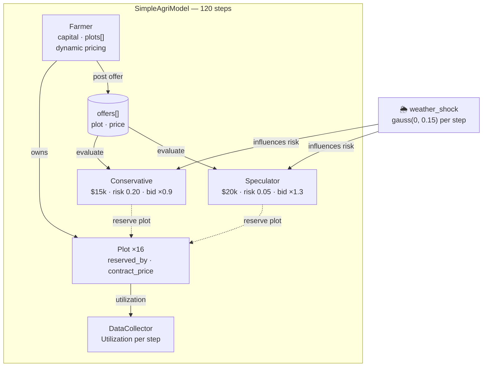

# AI Farmer – Tomato Plot Contract Simulation (Mesa ABM)

**A minimal agent-based model** exploring prepaid farm plot contracts, investor behavior, and the potential emergence of a secondary market.

This is an early prototype inspired by the idea of investors prepaying for fractions of a farm's future produce (like tech companies prepaying for RAM), with the goal of eventually simulating secondary trading of contracts when the farm is "sold out" and expansion loans are delayed.



## Current Features (v0.2 – Advanced Primary Market)

- **Dynamic Farmer Pricing**: The farmer now raises prices as utilization (pre-sold plots) increases, simulating price discovery pressure.
- **Differentiated Investors**: Investors are split into **Speculators** (high risk tolerance, aggressive bidding) and **Conservative** (low risk tolerance, cautious bidding).
- **Seasonal Volatility**: A `weather_shock` varies each step (representing weeks/seasons), affecting how investors value future yields.
- **Valuation Formula**:
  ```
  value = (spot_price × expected_yield × (1 - perceived_risk)) * bid_multiplier
  ```
- **Primary Market Logic**: Farmer offers plots; investors evaluate, purchase if price < valuation, and remove offers from the queue.
- **Mesa 3.5.1 Optimized**: Uses the latest `AgentSet` and model-based agent management patterns.

## Information Effects Research (Core Hypothesis)

We are testing the hypothesis that **information symmetry significantly impacts market stability and price convergence.**

### Information Tiers

| Tier | What the agent knows | Behavioral Implementation |
|---|---|---|
| **Blind** | Only current offer price | Base logic (greedy purchasing) |
| **Local** | Their own trade history | Anchoring to their personally paid average |
| **Market** | Average recent trade prices | Values tied to `model.public_price_index` |
| **Full** | All holdings & valuations | Bidding up based on observed competitor interest |

**Hypothesis**: *Market volatility will decrease but wealth concentration (Gini coefficient) will increase as information availability moves from Blind to Market tiers.*


## Secondary Market (Milestone 2)

A sketch of the upcoming secondary trading logic:
- **Speculator Flip**: Speculators will list holdings for sale (secondary offers) when market price > cost basis + premium.
- **Secondary Discovery**: Other investors will scan secondary offers if the primary farmer is "sold out" or has no active offers.

## Why Mesa 3.5.1 Required These Changes

Mesa underwent major API changes starting in 3.0+ (schedulers removed, `AgentSet` introduced). This repo uses the modern idiomatic style.

### Key fixes applied:
1. **Agent initialization**: `super().__init__(model)` is used (no `unique_id` in super call).
2. **No explicit scheduler**: Uses `self.agents.shuffle_do("step")` for random activation.
3. **Internal AgentSet**: No need to manually create `self.agents`; Mesa handles it.

## How to Run

```bash
# Assuming you have mesa, pandas, numpy installed
python main.py
```

## Requirements

```text
mesa>=3.5.1
pandas
numpy
```

## License

This project is licensed under the **MIT License**. See the [LICENSE](LICENSE) file for details.

Happy modeling!
